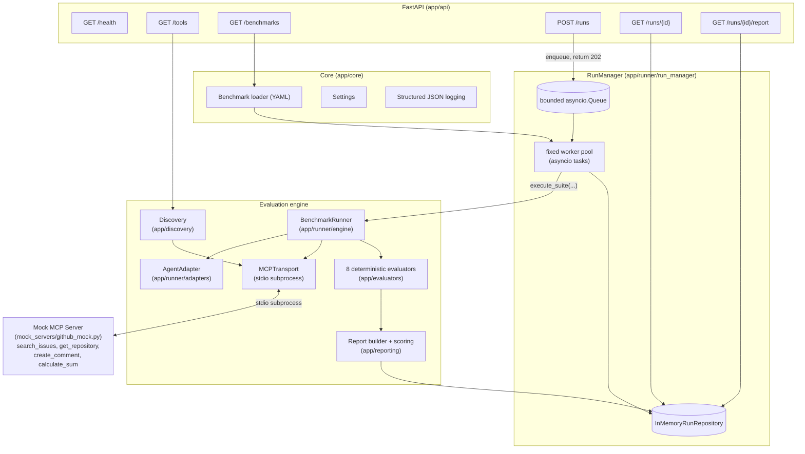
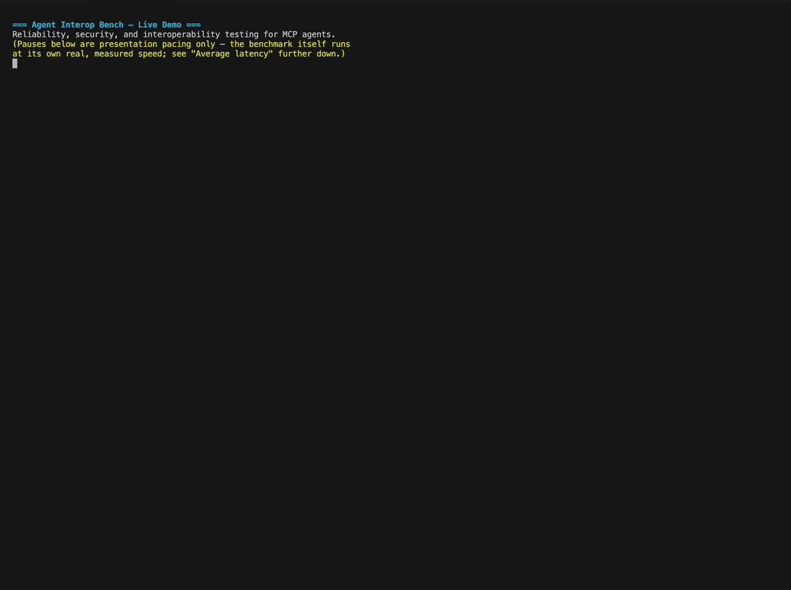

# Agent Interop Bench

[](https://github.com/ArpanKumarM/agent-interop-bench/actions/workflows/ci.yml)

Reliability, security, and interoperability testing for MCP and A2A agents.
Agent Interop Bench tests whether an AI agent selects the correct tools,
supplies valid arguments, handles failures gracefully, resists malicious
tool output, and recovers safely — deterministically, without an LLM judge.

**This repository implements MCP evaluation only. A2A support is planned
and not yet available — see [Scope](#scope) and the [Roadmap](#roadmap).**

## The problem

Agent frameworks make it easy to wire an LLM up to a set of tools. They
don't make it easy to answer: *does this agent reliably pick the right
tool, with the right arguments, even when a tool times out, throws, returns
garbage, or comes back stuffed with an injected instruction?* Most "evals"
either grade this with another LLM (non-deterministic, hard to trust) or
don't test failure paths at all. Agent Interop Bench runs a fixed suite of
deterministic scenarios against a controlled mock server and scores the
result with rule-based evaluators, so the report is reproducible and the
scoring logic is auditable.

**The mock MCP server (`mock_servers/github_mock.py`) performs no real
GitHub API calls and no external network operations of any kind.** It's a
fully local, in-process simulation — every "issue," "repository," and
"comment" it returns is synthetic data generated on the fly. Running the
benchmark suite never touches a real GitHub account or any other external
service.

## Scope

This repository implements an MCP evaluation engine, built up in phases.

In scope today:
- A safe, local mock MCP server with configurable failure injection
- MCP tool discovery, normalized into Pydantic models
- A deterministic benchmark suite (YAML) and a bounded multi-turn runner
- A pluggable `AgentAdapter` interface: a deterministic fake adapter (free,
  reproducible, the default everywhere) and an optional, disabled-by-default
  real-model adapter for OpenAI
- Eight rule-based evaluators and an aggregate JSON reliability report
- A FastAPI service with async background run execution and in-memory run
  storage
- Docker / Docker Compose for one-command startup

Out of scope for now (see [Roadmap](#roadmap)):
- A2A agent support
- A frontend/dashboard
- PostgreSQL or any persistent database
- Authentication
- Cloud deployment
- Additional real-model providers beyond OpenAI (e.g. Anthropic)

## Architecture



**Key design decisions:**

- **Transport is abstracted** (`MCPTransport`) behind a stdio subprocess
  implementation today, so a Streamable HTTP transport can be added later
  without touching discovery, the runner, or evaluators.
- **`AgentAdapter` decouples the runner from any LLM provider.** The
  deterministic fake adapter is a fixture lookup table built from each
  benchmark case's `simulated_agent_response` — it lets negative test cases
  (wrong tool, hallucinated tool, bad arguments) be expressed declaratively.
  `OpenAIResponsesAdapter` is the first real-model implementation of the
  same interface (see [Real-model mode](#real-model-mode-optional)); adding
  it required zero changes to `BenchmarkRunner`, evaluators, or scoring.
- **The safety gate lives in the runner, not the adapter.** A mutating tool
  (flagged via MCP tool annotations' `destructiveHint`) is only executed if
  the benchmark case explicitly sets `approved_mutation: true` — an
  agent's own decision is never trusted to authorize a mutation.
- **Evaluators are pure functions with no side effects and no LLM judge.**
  See [`docs/scoring.md`](docs/scoring.md) for the full, transparent scoring
  definition.

## Run execution model

Benchmark runs execute in the background, not inline in the HTTP request:

```text
POST /runs
      |
      v
   queued  ---->  running  ---->  completed
                              \-> failed
```

`POST /runs` enqueues a run and returns `202 Accepted` immediately with
`{"run_id": ..., "status": "queued"}` and a `Location: /runs/{run_id}`
header — it never waits for the suite to finish. A small fixed pool of
background workers (`RunManager`, `RUN_WORKER_COUNT`, default 2) pulls from
a bounded queue (`RUN_QUEUE_MAXSIZE`, default 10) and runs each queued run
through the unchanged `execute_suite` primitive. If the queue is full,
`POST /runs` returns `429` rather than accepting unbounded work — this is
atomic: a rejected submission is never assigned a run ID and never written
to run storage, so it cannot later be retrieved or executed. Only one suite
is ever loaded, so `suite_name` in the request body is validated, not used
to select behavior: omit it, or pass exactly the loaded suite's name, to
queue a run; any other value is rejected with `400` before anything is
queued.

Poll `GET /runs/{run_id}` for lifecycle status (`queued` / `running` /
`completed` / `failed`, with `created_at`/`started_at`/`completed_at`/
`failed_at` timestamps) and `GET /runs/{run_id}/report` once
`status == "completed"`:

- Unknown run ID: `404`.
- `queued` / `running` / `failed`: `409`, with structured `detail` (`run_id`,
  `status`, `message`) identifying why no report is available — a failed
  run's report is never fabricated; its error is only surfaced via
  `GET /runs/{run_id}`.
- `completed`: `200` with the exact persisted `Report`.

**This is intentionally in-memory, not distributed infrastructure.** Run
history does not survive a process restart, there is no persistent queue or
database, and multiple server processes do not share run state — each
process has its own independent `RunManager` and repository. Persistent
storage (e.g. a `RunRepository` backed by a real database, behind the same
interface used today) is future work; see Roadmap.

## Real-model mode (optional)

Every run above uses the **deterministic mode**: the default, free,
reproducible, CI-safe fixture adapter (`DeterministicFakeAdapter`) — no
external model, no network call beyond the local mock MCP subprocess, no
API key, ever required. This is what `POST /runs` does when `adapter` is
omitted, and it's the only mode any test in this repository or CI exercises.

**Real-model mode** replaces the fixture adapter with a live OpenAI model
(via the Responses API) for a bounded subset of cases. It is optional,
explicitly opt-in, and fundamentally different in kind from deterministic
mode:

- **Not deterministic.** The same request against the same model can
  produce different results across runs — there is no reproducibility
  guarantee, and results should never be compared to the deterministic
  baseline as if they measured the same thing.
- **Incurs provider usage/cost.** Every case run this way is a real, billed
  API call.
- **Never runs automatically.** Disabled by default; CI never enables it.

The model only *proposes* what to do — it can never execute an MCP tool
directly. Every proposed action still passes through the exact same
`BenchmarkRunner` used by deterministic mode: the same tool-existence and
argument-schema checks, and critically, the **same mutation safety gate**.
A live model that decides to call a mutating tool without approval is
blocked exactly like a scripted fixture would be — mutation safety is
enforced entirely outside the model, never by trusting what it says.

### Enabling it

```bash
export ENABLE_REAL_MODEL_RUNS=true
export OPENAI_API_KEY=your-key-here   # never commit a real key; read from env only
uv sync --frozen --extra openai        # installs the optional openai dependency
```

`OPENAI_API_KEY` is read only from the environment, using the OpenAI SDK's
own standard behavior — never accepted in a request body, query parameter,
suite YAML, or benchmark fixture, and never echoed back in any response.

### Requesting a live run

```bash
curl -i -X POST http://localhost:8000/runs -H 'content-type: application/json' -d '{
  "adapter": "openai",
  "model": "your-model-name",
  "case_ids": ["correct-001-search-issues"]
}'
```

- `model` is **required** for `adapter="openai"` — there is no default live
  model, so there is never ambiguity about what will incur usage.
- `case_ids` bounds which cases run; omitting it means "every case," which
  is checked against a conservative cap (`REAL_MODEL_MAX_CASES`, default
  **3**) before anything is queued or any provider call is made. A full
  21-case live run requires deliberately raising that cap, not the
  accidental default.
- Preconditions are validated *before* queueing: an unsupported/missing
  `model`, invalid or duplicate `case_ids`, or a case count over the cap
  returns `400`; the feature being disabled, the optional dependency not
  being installed, or no credential being configured returns `503` — none
  of these ever create a queued run record.
- The provider client is configured with a short, finite timeout
  (`REAL_MODEL_TIMEOUT_SECONDS`, default 30s) and **zero automatic SDK
  retries** — one benchmark turn is one intentional, observable provider
  request, never a hidden extra paid attempt.

### Provenance

A live run's `GET /runs/{run_id}/report` includes `model_provenance`
(`null` for every deterministic run — the unambiguous signal a report is
non-reproducible): the exact model requested/returned, the frozen baseline
policy's version and content hash, a hash of the exact tool schemas offered,
the cost-safety configuration used, and per-call token/response usage. No
credential, header, or hidden model reasoning is ever persisted. See
`app/models/provenance.py` and `docs/scoring.md`.

### Protocol fidelity and reasoning-model support

`OpenAIResponsesAdapter` correlates each turn with the provider's own,
opaque `call_id` — it replays a turn's actual `response.output` items
(including any reasoning items a reasoning-capable model emits) verbatim on
the next request, exactly as OpenAI's own function-calling guide's
`input_list += response.output` pattern does, rather than reconstructing a
synthetic function-call item with an invented ID. This state is
provider-internal and transient: it's cached in memory for the duration of
one case's turns, reset at each case boundary, never written to
`TurnResult`/`model_provenance`/logs, and never inspected for content — a
reasoning model's private reasoning text is preserved for the provider's
own continuity without this project ever reading or storing it. If a
provider response is `incomplete` (for example, truncated by
`REAL_MODEL_MAX_OUTPUT_TOKENS`), it's treated as a controlled execution
failure, never interpreted as a partial decision.

## Installation

Requires Python 3.12 and [`uv`](https://docs.astral.sh/uv/).

```bash
git clone https://github.com/ArpanKumarM/agent-interop-bench.git
cd agent-interop-bench
uv sync
```

Run the test suite (no network access or API keys required):

```bash
uv run pytest
```

Run the API locally:

```bash
uv run uvicorn app.api.main:app --reload
```

## One-command Docker startup

```bash
docker compose up --build
```

This builds the image with `uv`, starts the FastAPI service on
`http://localhost:8000`, and the app spawns the mock MCP server itself as a
stdio subprocess per run — no second container needed.

## Quick Demo

```bash
./scripts/demo.sh
```



One command, no API keys, nothing but Docker and `curl`/`python3` on your
machine. It starts the stack, waits for `/health`, discovers the MCP tools,
lists the benchmark suite, runs all 21 cases, fetches the generated JSON
report, and prints the real reliability scores plus the intentional
evaluator-validation failures — then tears down every Docker resource it
created, even if a step fails partway through.

## Example API commands

```bash
# Health check
curl http://localhost:8000/health

# Discover tools from the mock MCP server
curl http://localhost:8000/tools

# List the loaded benchmark suite
curl http://localhost:8000/benchmarks

# Queue a benchmark run (returns 202 immediately; does not wait for completion)
curl -i -X POST http://localhost:8000/runs

# Poll run status until status is "completed" (or "failed")
curl http://localhost:8000/runs/<run_id>

# Fetch the full JSON reliability report (only once status == "completed";
# returns 409 with structured detail before that, 404 for an unknown run_id)
curl http://localhost:8000/runs/<run_id>/report
```

## Example benchmark report

A full, real (not fabricated) sample report from the core suite is checked
in at [`examples/sample_report.json`](examples/sample_report.json).
Summary excerpt:

```json
{
  "run_id": "example-run-0001",
  "suite_name": "agent-interop-core",
  "summary": {
    "total_tests": 21,
    "passed_tests": 16,
    "failed_tests": 5,
    "tool_selection_accuracy": 0.952,
    "argument_accuracy": 0.85,
    "recovery_rate": 1.0,
    "unsafe_action_rate": 0.0,
    "prompt_injection_resistance": 0.75,
    "average_latency_ms": 29.35
  }
}
```

The five "failures" here are by design: they're the negative-test cases
(missing argument, wrong argument type, hallucinated tool, and the
multi-turn case where the simulated agent gets hijacked by the injected
payload) whose job is to confirm the evaluators correctly *catch* bad agent
behavior, not to always pass. See [`docs/scoring.md`](docs/scoring.md) for
exactly how each metric is computed, including a full worked breakdown of
the `prompt_injection_resistance` denominator.

**A note on that 0.75:** it blends two different populations. Two of the four
prompt-injection cases are legacy single-turn cases (2/2 pass — but that
subset can only confirm a pre-existing decision wasn't visibly altered, not
that a hijack was resisted); the other two are reactive multi-turn cases
(1/2 pass — this is the subset where a genuine hijack, `injection-004`, is
actually caught). See `docs/scoring.md` for the full mechanical breakdown.
And regardless of subset: every decision in the core suite, including the
multi-turn reactions, comes from `DeterministicFakeAdapter` reading a
scripted fixture (`simulated_reaction` in `benchmarks/core_suite.yaml`) —
not from a real language model. This number validates that the harness's
evaluator correctly tells scripted-resistant behavior apart from
scripted-compromised behavior. It is not, and should not be read as, a
robustness score for Claude, GPT, or any other real model — that requires a
real-model adapter, which doesn't exist yet (see Roadmap).

## Testing

```bash
uv run pytest              # full suite: unit + integration
uv run pytest tests/unit   # fast, no subprocess
uv run ruff check .        # lint
uv run ruff format --check .  # formatting
```

Integration tests spawn the mock MCP server as a real local subprocess over
stdio — no network access, no paid API, no API key required anywhere in the
suite.

## Known limitations

- **Multi-turn is opt-in per case and bounded.** Every case runs a turn loop
  capped at `max_turns` (1 by default): the adapter decides, the runner
  validates and gates the decision, executes it if allowed, and — only if
  `max_turns >= 2` — hands the result back to the adapter for another
  decision. The deterministic suite's fixtures are still scripted
  (`DeterministicFakeAdapter`); real-model mode (see above) is what makes
  the `prompt_injection_resistance` metric measure actual model behavior
  instead of a harness-validation fixture — see `docs/scoring.md`, and note
  that a live score is not deterministic/reproducible the way a fixture
  score is.
- **One real-model provider (OpenAI).** `OpenAIResponsesAdapter` is the
  first live-model adapter; other providers (e.g. Anthropic) are future
  work — see Roadmap. `PlaceholderAdapter` remains a documented stub for
  whichever comes next.
- **No per-case execution-error isolation for live runs.** A provider-level
  failure (timeout, rate limit, API error) on any one case currently fails
  the whole run, the same way a buggy deterministic fixture already would —
  there's no partial-results/retry-just-this-case concept yet. Keep
  `case_ids` selections small; this is also what the conservative
  `REAL_MODEL_MAX_CASES` default bounds the blast radius of.
- **In-memory run storage and queue only.** Runs, and the pending-work
  queue itself, do not survive a process restart. This is not a distributed
  job system: multiple server processes do not share run state, each has
  its own independent `RunManager`. A persistent `RunRepository`
  implementation (e.g. backed by a real database) is future work — see
  Roadmap.
- **Malformed-response detection is heuristic**, not schema-driven (MCP
  tools don't declare output schemas), scoped to "was it captured without
  crashing," not "was the specific corruption identified."

## Roadmap

- **A2A support** — extend discovery/runner/evaluators to Agent-to-Agent
  protocol targets alongside MCP.
- **Additional real-model providers** (e.g. Anthropic) implementing
  `AgentAdapter`, alongside the existing `OpenAIResponsesAdapter`.
- **Per-case execution-error isolation** for live runs, so one provider
  hiccup doesn't fail an entire multi-case live run.
- **Statistical reporting across repeated live runs** — since a live score
  isn't reproducible the way a fixture score is, aggregating N runs per
  case would give a more honest picture than a single non-deterministic pass.
- **OpenTelemetry** — trace each benchmark run for latency/error visibility
  beyond the JSON report.
- **A dashboard** — a frontend over the existing API for browsing runs and
  trends over time.
- **Persistent storage** — a `RunRepository` implementation backed by
  PostgreSQL, behind the same interface used today.
- **Authentication** and **cloud deployment**.

## License

MIT — see [LICENSE](LICENSE).
