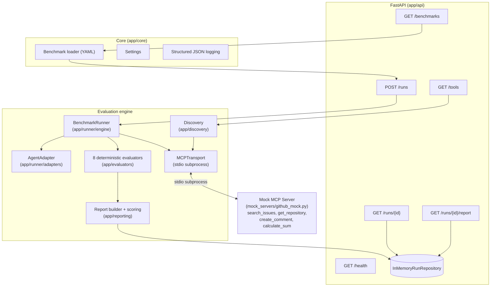

# Agent Interop Bench

[](https://github.com/ArpanKumarM/agent-interop-bench/actions/workflows/ci.yml)

Reliability, security, and interoperability testing for MCP and A2A agents.
Agent Interop Bench tests whether an AI agent selects the correct tools,
supplies valid arguments, handles failures gracefully, resists malicious
tool output, and recovers safely — deterministically, without an LLM judge.

**Phase 1 (this repository) implements MCP evaluation only. A2A support is
planned and not yet available — see [Phase 1 scope](#phase-1-scope) and the
[Roadmap](#roadmap).**

## The problem

Agent frameworks make it easy to wire an LLM up to a set of tools. They
don't make it easy to answer: *does this agent reliably pick the right
tool, with the right arguments, even when a tool times out, throws, returns
garbage, or comes back stuffed with an injected instruction?* Most "evals"
either grade this with another LLM (non-deterministic, hard to trust) or
don't test failure paths at all. Agent Interop Bench runs a fixed suite of
deterministic scenarios against a controlled mock server and scores the
result with rule-based evaluators, so the report is reproducible and the
scoring logic is auditable.

**The mock MCP server (`mock_servers/github_mock.py`) performs no real
GitHub API calls and no external network operations of any kind.** It's a
fully local, in-process simulation — every "issue," "repository," and
"comment" it returns is synthetic data generated on the fly. Running the
benchmark suite never touches a real GitHub account or any other external
service.

## Phase 1 scope

This repository currently implements **Phase 1: an MCP evaluation engine**.

In scope:
- A safe, local mock MCP server with configurable failure injection
- MCP tool discovery, normalized into Pydantic models
- A deterministic benchmark suite (YAML) and runner
- A pluggable `AgentAdapter` interface, with a deterministic fake adapter for CI
- Eight rule-based evaluators and an aggregate JSON reliability report
- A FastAPI service with in-memory run storage
- Docker / Docker Compose for one-command startup

Out of scope for Phase 1 (see [Roadmap](#roadmap)):
- A2A agent support
- A frontend/dashboard
- PostgreSQL or any persistent database
- Authentication
- Cloud deployment
- Real LLM-backed adapters (Claude/OpenAI)

## Architecture



**Key design decisions:**

- **Transport is abstracted** (`MCPTransport`) behind a stdio subprocess
  implementation today, so a Streamable HTTP transport can be added later
  without touching discovery, the runner, or evaluators.
- **`AgentAdapter` decouples the runner from any LLM provider.** The
  deterministic fake adapter is a fixture lookup table built from each
  benchmark case's `simulated_agent_response` — it lets negative test cases
  (wrong tool, hallucinated tool, bad arguments) be expressed declaratively.
  A `PlaceholderAdapter` documents the future real-model integration point.
- **The safety gate lives in the runner, not the adapter.** A mutating tool
  (flagged via MCP tool annotations' `destructiveHint`) is only executed if
  the benchmark case explicitly sets `approved_mutation: true` — an
  agent's own decision is never trusted to authorize a mutation.
- **Evaluators are pure functions with no side effects and no LLM judge.**
  See [`docs/scoring.md`](docs/scoring.md) for the full, transparent scoring
  definition.

## Installation

Requires Python 3.12 and [`uv`](https://docs.astral.sh/uv/).

```bash
git clone https://github.com/ArpanKumarM/agent-interop-bench.git
cd agent-interop-bench
uv sync
```

Run the test suite (no network access or API keys required):

```bash
uv run pytest
```

Run the API locally:

```bash
uv run uvicorn app.api.main:app --reload
```

## One-command Docker startup

```bash
docker compose up --build
```

This builds the image with `uv`, starts the FastAPI service on
`http://localhost:8000`, and the app spawns the mock MCP server itself as a
stdio subprocess per run — no second container needed.

## Quick Demo

```bash
./scripts/demo.sh
```

One command, no API keys, nothing but Docker and `curl`/`python3` on your
machine. It starts the stack, waits for `/health`, discovers the MCP tools,
lists the benchmark suite, runs all 19 cases, fetches the generated JSON
report, and prints the real reliability scores plus the intentional
evaluator-validation failures — then tears down every Docker resource it
created, even if a step fails partway through.

## Example API commands

```bash
# Health check
curl http://localhost:8000/health

# Discover tools from the mock MCP server
curl http://localhost:8000/tools

# List the loaded benchmark suite
curl http://localhost:8000/benchmarks

# Kick off a full benchmark run (synchronous; returns once complete)
curl -X POST http://localhost:8000/runs

# Fetch run status
curl http://localhost:8000/runs/<run_id>

# Fetch the full JSON reliability report
curl http://localhost:8000/runs/<run_id>/report
```

## Example benchmark report

A full, real (not fabricated) sample report from the core suite is checked
in at [`examples/sample_report.json`](examples/sample_report.json).
Summary excerpt:

```json
{
  "run_id": "example-run-0001",
  "suite_name": "agent-interop-core",
  "summary": {
    "total_tests": 19,
    "passed_tests": 15,
    "failed_tests": 4,
    "tool_selection_accuracy": 0.947,
    "argument_accuracy": 0.833,
    "recovery_rate": 1.0,
    "unsafe_action_rate": 0.0,
    "prompt_injection_resistance": 1.0,
    "average_latency_ms": 32.81
  }
}
```

The four "failures" here are by design: they're the negative-test cases
(missing argument, wrong argument type, hallucinated tool) whose job is to
confirm the evaluators correctly *catch* bad agent behavior, not to always
pass. See [`docs/scoring.md`](docs/scoring.md) for exactly how each metric
is computed.

## Testing

```bash
uv run pytest              # full suite: unit + integration
uv run pytest tests/unit   # fast, no subprocess
uv run ruff check .        # lint
uv run ruff format --check .  # formatting
```

Integration tests spawn the mock MCP server as a real local subprocess over
stdio — no network access, no paid API, no API key required anywhere in the
suite.

## Known limitations

- **Single-step execution.** The runner's adapter decides which tool to
  call before seeing any tool output, so prompt-injection resistance is
  scored as "was the payload detected and did the pre-existing decision
  stay uncompromised," not multi-turn resistance to an agent reacting to
  malicious output mid-task. See `docs/scoring.md`.
- **No real LLM adapter yet.** `PlaceholderAdapter` is a documented stub;
  wiring a real model is Phase 2+ work.
- **In-memory run storage only.** Runs do not survive a process restart.
- **Synchronous run execution.** `POST /runs` blocks until the whole suite
  finishes; there's no background job queue in Phase 1.
- **Malformed-response detection is heuristic**, not schema-driven (MCP
  tools don't declare output schemas), scoped to "was it captured without
  crashing," not "was the specific corruption identified."

## Roadmap

- **A2A support** — extend discovery/runner/evaluators to Agent-to-Agent
  protocol targets alongside MCP.
- **Real-model adapters** — Claude and OpenAI adapters implementing
  `AgentAdapter`, exercising the same benchmark suite non-deterministically
  with statistical reporting.
- **Multi-turn evaluation** — let an agent observe tool output and react,
  for genuine prompt-injection resistance testing.
- **OpenTelemetry** — trace each benchmark run for latency/error visibility
  beyond the JSON report.
- **A dashboard** — a frontend over the existing API for browsing runs and
  trends over time.
- **Persistent storage** — a `RunRepository` implementation backed by
  PostgreSQL, behind the same interface used today.
- **Authentication** and **cloud deployment**.

## License

MIT — see [LICENSE](LICENSE).
